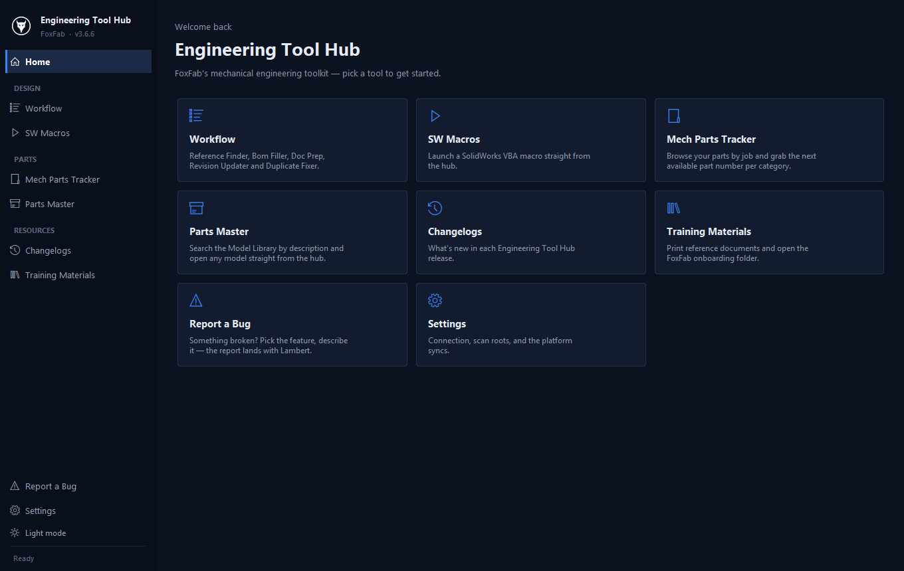
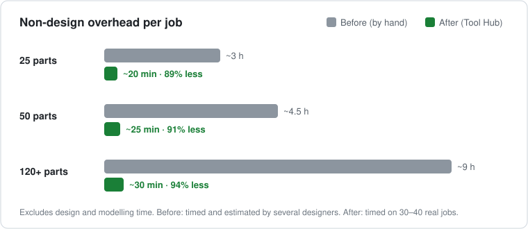
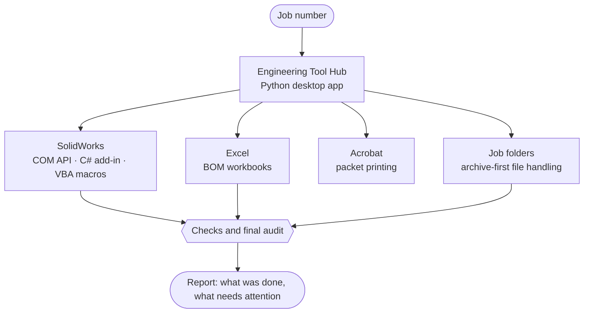

# Engineering Tool Hub

> One desktop app that takes the paperwork out of every switchgear job: reference lookup, BOMs, drawing exports, revisions and the printed manufacturing packet, all driven from a single job number.

> **Showcase repository.** The application's source code belongs to my employer and is not published here. This repo documents what the tool does, how it works and what it changed. Every job number, customer name, part number and file path shown is invented.

The real application, v3.6.6. Screenshots in this repo show the app with no job loaded.

---

## At a glance

| | |
|---|---|
| **89–94%** | less non-design overhead per job, timed on 30–40 real jobs |
| **10 of 10** | designers on the team use it; it is the standard way jobs are released |
| **48 releases** | from v1.0 (March 2026) to v3.6.6 (September 2026) |
| **400+** | automated tests guarding the logic that touches production files |
| **1 person** | designed, built, tested and deployed it, alongside a full-time design workload |

## The problem

I am a mechanical designer at FoxFab, which builds custom low-voltage switchboards and power-connection equipment: sheet-metal enclosures with copper bus work inside.

On a typical job I was spending as long on the non-engineering work as on the design itself, and sometimes longer. Finding a past job to work from. Exporting a flat pattern for every sheet-metal part. Building the bill of materials. Chasing the latest revision of each drawing. Printing the packet for the shop in the right order. None of it is design, all of it has to be right, and the folder structure meant dozens of clicks to reach each file.

So I built a tool to do it.

## What it is

A Windows desktop app that puts a design team's entire post-modelling workflow behind **one job number**. Type the number once; the hub finds the job's folders, drives SolidWorks, Excel and Acrobat, and runs the repetitive steps with checks before and after.

Two rules shaped every feature:

- **Never overwrite.** Anything about to be replaced is moved to an archive folder first.
- **Check, then report.** Each tool verifies its own result against the files on disk and says plainly what it found.

## Impact

| Job size | Before | After | Reduction |
|---|---|---|---|
| 25 parts | ~3 h | **~20 min** | 89% |
| 50 parts | ~4.5 h | **~25 min** | 91% |
| 120+ parts | ~9 h | **~30 min** | 94% |

"Overhead" means everything after the model is finished: BOM, drawing and flat-pattern exports, revisions, and the printed packet. Design and modelling time is not counted.

**How these were measured.** The *before* times were timed and estimated by me and other designers doing the work by hand. The *after* times were timed on 30–40 real jobs run through the tool. The per-tool figures further down were timed tool by tool.

**Projected annual saving:** 500–1,000 engineer-hours per year, calculated from those per-job savings on a 4-designer sample. The full team of 10 now uses the tool. No new software licences were needed.

## See it work

Three worked examples, each on its own page. All use an invented job.

### [1. One revision: nine manual steps become one click →](docs/revision-updater.md)

A team lead asks for one extra hole in a sheet-metal part. By hand that means finding the job, finding the current revision, exporting a new PDF and DXF, archiving the old ones, updating every assembly drawing that shows the part, updating the BOM and emailing the CNC programmer: **15–20 minutes per part**, with two steps people regularly got wrong. The hub watches SolidWorks saves and does the whole chain in **10–15 seconds**.

### [2. A BOM that checks itself →](docs/bom-checks.md)

The BOM is built straight from the SolidWorks assembly and then checked in both directions: every part in the BOM must have its model, drawing and flat pattern on disk, and every fabrication file on disk must appear in the BOM. **45–90 minutes becomes 1–2 minutes**, and the mismatches that used to reach the shop floor are caught at the desk.

### [3. A full 50-part job, start to finish →](docs/full-job-walkthrough.md)

One job followed through every stage, with the old time and the new time side by side: **about 4.5 hours of overhead down to about 25 minutes**.

## Built with AI, and built to be safe

I started this project knowing basic programming. To finish it I had to learn Python, the SolidWorks API, C#, automated testing and interface design, and, above all, how to build reliable software with an AI coding assistant.

My honest estimate is that without AI this would have taken years, or a dedicated senior software or automation engineer. With it, one mechanical designer shipped it in under six months.

Getting code written was never the hard part. The hard part was making sure the tools were safe and that they had actually done what they reported, because AI-written code fails in a particular way: it looks finished, it reports success, and it is wrong.

**[Read the full write-up: what went wrong, and the rules I work by now →](docs/building-with-ai.md)**

It covers three real failures:

- a refused operation that the screen reported as *finished*;
- a "test folder only" safety guard that compared a folder against itself and passed;
- an AI statement that was confidently wrong, repeated several times, and the habit I built to stop relearning the same lesson.

## The tools

| # | Tool | What it does | Before → after |
|---|---|---|---|
| 1 | **Reference Finder** | Reads a new job's release form, then scores and ranks past jobs as starting points, with the drawings side by side | 25–30 min, up to an hour when the old index entry was blank → **30 s** |
| 2 | **BOM Filler / Generate** | Builds the BOM from the SolidWorks assembly, runs two-way checks against the files on disk, marks stock parts, pulls the latest revision of each drawing | 45–90 min → **1–2 min** |
| 3 | **Doc Prep & Print** | Assembles the full manufacturing packet and prints it in shop order through one Acrobat session | 45–90 min → **≤10 min** |
| 4 | **Revision Updater** | Watches SolidWorks saves; one click bumps revisions, exports PDF and DXF, archives the old files, regenerates the BOM, finds affected CNC programs and drafts the programmer email | 15–20 min → **10–15 s** per part |
| 5 | **Pack & Go** (macro) | Copies and renumbers a reference job's parts, rewires the assemblies, applies copper bend deduction, stamps the title block | 5–10 min → **10–15 s** |
| 6 | **Export to DXF** (macro) | Batch flat-pattern export for CNC | 2–3 min → **3–6 s** per part |
| 7 | **PDF Publish** (macro) | Batch drawing-to-PDF export, routed to the right folders, with a check that every file landed | 10–15 min → **5–6 min** |
| 8 | **Duplicate Fixer** | Renumbers a duplicated part end to end (model, flats, CNC program, PDFs, BOM, email), with backups first | — |
| 9 | **Parts Tracker** | Next free part number per category, collision checks, gap analysis, duplicate detection | — |
| 10 | **Parts Master** | Searchable library of ~3,500 models in ~75 categories, with thumbnails; matches electrical BOM lines to library parts | — |
| 11 | **Refresh Files / eDrawings** | Keeps published PDFs and DXFs in step with the CAD; publishes 3D viewer files for the shop floor | — |
| 12 | **Training · Changelog · Report a Bug · Settings** | In-app onboarding material, release notes, one-click bug reports with logs attached | — |

The first thing I automated was the reference search. Designers used to search a spreadsheet of thousands of past jobs, roughly a fifth to a third of them with blank entries, and the job they settled on was often not the best match. The tool returns the five best candidates with the reasons for each score.

## How it is built

- **SolidWorks.** A native C# add-in plus the SolidWorks COM API attach to the running session for BOM generation, PDF, DXF and 3D-viewer export, and reference repair. VBA macros are launched from the hub.
- **Guardrails.** Archive-first file handling, pre-flight checks that block a run before anything is written, two-way CAD-to-BOM checks, a final audit, and a test mode that confines every write to a sandbox folder.
- **Testing.** 400+ automated tests. The Python BOM builder was validated cell for cell against the output of the Excel macro it replaced.
- **Deployment.** One packaged `.exe` on the team's network share. A launcher copies it to each machine and runs it locally, so a new release never interrupts someone mid-job.
- **Feedback loop.** A built-in bug reporter sends the description and logs straight to me.

**Tech:** Python · Tkinter · PyInstaller · SolidWorks API (COM) · C# · VBA · xlwings · Acrobat COM · PyMuPDF · pytest · Claude Code

## Timeline

| Date | Milestone |
|---|---|
| 27 March 2026 | v1.0. Three separate tools combined into one desktop app |
| 28 July 2026 | v2.0. Full redesign; the main tools rebuilt around a single job-number field; Reference Finder added to the app |
| 13 August 2026 | Team deployment: every designer runs the same build |
| 14 August 2026 | v3.0. One design system across the whole app; built-in bug reporter |
| 11 September 2026 | v3.6.6. 48 releases; all 10 designers use it as the standard workflow |

The moment that mattered most was not a release. It was when the tool stopped being mine: other designers were running their own jobs through it without asking me how.

## Related

- [Engineering Vault](https://github.com/LambertBadong/foxfab-engineering-vault): the knowledge base this hub works alongside.

---

Built by **Lambert Badong** · [lambertbadong.github.io](https://lambertbadong.github.io)
