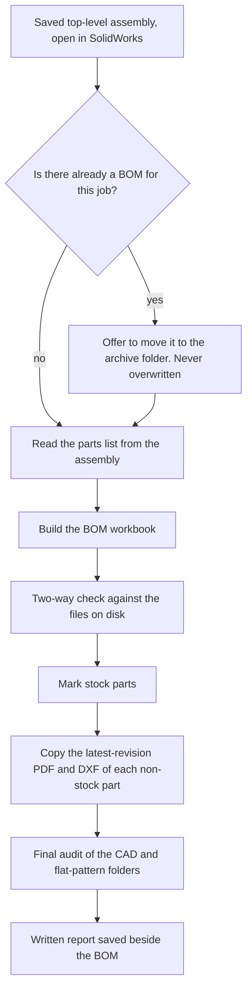

# A BOM that checks itself

[← Back to overview](../README.md)

> All job numbers, customer names, part numbers and paths on this page are invented.

## Why the BOM matters

The bill of materials is what the shop builds from. If a part is missing from it, the part is not made. If it lists a part whose flat pattern was never exported, the CNC programmer has nothing to cut. Both mistakes surface late, on the shop floor, when they are most expensive.

## Before: by hand

1. Create a drawing of the top-level assembly.
2. Insert a BOM table and save it out as an Excel file.
3. Run a formatting macro to turn that into the company BOM workbook.
4. Look up each part to see whether it is a stock part, and mark it.
5. For every non-stock part, find the latest-revision PDF and DXF and copy them into the job's folder.
6. Scan the result by eye for anything missing.

**45–90 minutes**, most of it in steps 4 and 5, and step 6 relied on attention at the end of a long task.

## After: one button

With the top-level assembly open and saved in SolidWorks, the designer presses **Run**. The job number and folders are read from the assembly's own file path.



**1–2 minutes.** About 20 seconds when the assembly is already fully loaded.

<!-- SCREENSHOT SLOT 3: BOM Filler finished, with the check report visible. -->

## The two-way check

Most checks only ask one question: *is everything in the BOM present on disk?* This one also asks the reverse: *is everything on disk in the BOM?* The second question is the one that finds a part that quietly dropped out of the assembly.

| Direction | Question | What a failure means |
|---|---|---|
| BOM → disk | Does every job-specific part in the BOM have its model, its drawing PDF and its flat-pattern DXF? | A part will reach the shop with no drawing or nothing to cut |
| Disk → BOM | Is every fabrication file in the job's folders listed in the BOM? | A part was modelled and exported but is not in the assembly, so it will not be built |

An illustrative report for the invented job J20417:

```
J20417 BOM check                                        2026-09-14 10:42

BOM -> disk     47 job parts checked
  OK            46
  MISSING DXF   240-71152        in the BOM, model and PDF found, no flat pattern

disk -> BOM     49 fabrication files checked
  OK            48
  NOT IN BOM    250-71208        model, PDF and DXF on disk, not in the assembly

Result: 2 findings. Fix and re-run.
```

Two findings, two real problems, both caught before anything was printed.

## A check that exposed a hidden SolidWorks setting

The reverse check kept flagging parts as "on disk but not in the BOM" when the designer could see them in the assembly.

The cause: when a part is copied from a reference job, the copy keeps a hidden SolidWorks setting that tells it to report itself in a BOM under the **original** part's number. SolidWorks then merges the copy into the original's row. On screen nothing looks wrong. In the BOM, the new part does not exist.

The tool now handles this itself: for any file the check flags, it opens the part, sets it to report under its own file name, saves it, and rebuilds the BOM once more so the delivered BOM is correct. Parts with unsaved changes are skipped and named in the report, never saved over.

This is a problem nobody was looking for. It was only found because the check asked the question in both directions.

## Proving the new BOM matches the old one

The Python code that builds the workbook replaced an Excel macro the team had trusted for years. Before switching over, I ran both on the same real assemblies and compared the two workbooks **cell by cell**. That comparison is now a permanent automated test: if a future change alters the output in any cell, the test fails.

## Guardrails

- **Never overwrites a BOM.** An existing BOM is moved to the archive folder, with the designer's agreement, before a new one is written.
- **Refuses an unsaved assembly.** The BOM must match what is on disk, so the run stops and says why.
- **Nothing is saved in SolidWorks to build the BOM.** The parts list is read from a throwaway drawing that is discarded.
- **A failed side-step never fails the BOM.** If publishing the 3D viewer file fails, the BOM still completes and the reason is printed.

---

[← One revision](revision-updater.md) · [Back to overview](../README.md) · Next: [A full 50-part job →](full-job-walkthrough.md)
