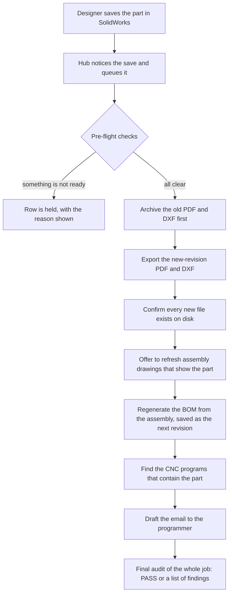
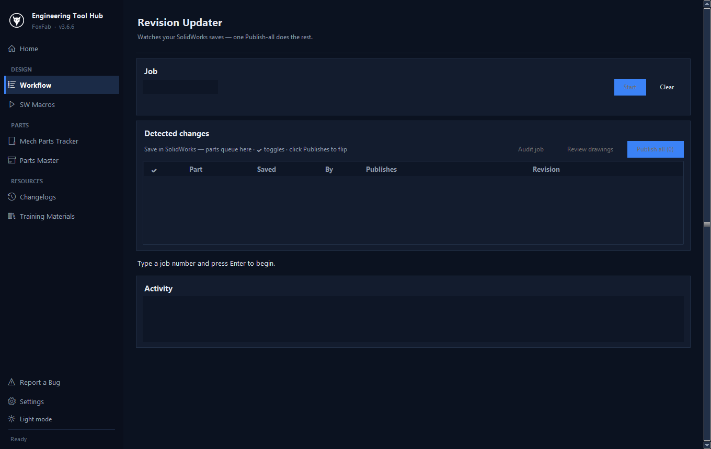

# One revision: nine manual steps become one click

[← Back to overview](../README.md)

> All job numbers, customer names, part numbers and paths on this page are invented.

## The situation

Job **J20417 – Harbourview Medical** is already released to the shop. The team lead walks over: the cable-support bracket, part `240-71136`, needs one more mounting hole.

It is a two-minute change in SolidWorks. Everything around it was not.

## Before: by hand

| # | Step | Slow | Easy to get wrong |
|---|---|:---:|:---:|
| 1 | Get the request from the team lead | | |
| 2 | Work out which job the part lives in | | |
| 3 | Open the part and make the edit | | |
| 4 | Find out what revision the part is currently at | | ● |
| 5 | Export a new PDF and a new flat-pattern DXF, named with the next revision | ● | |
| 6 | Move the old PDF and DXF into the archive folder | | ● |
| 7 | Update every assembly drawing that shows the part, and its revision | ● | |
| 8 | Update the BOM | ● | |
| 9 | Email the CNC programmer with what changed | | |

**15–20 minutes per part.** A typical job has one to four parts revised after release.

The two marked mistakes are the costly ones:

- **Wrong revision.** Copies of a part's drawing can exist in more than one place. Pick the wrong "latest" and the new file goes out as `rB` when `rB` already exists.
- **Forgotten archive.** If the old DXF stays in the live folder, two versions of the same part sit side by side, and the shop has no way to know which one to cut.

## After: the Revision Updater

The designer loads the job, presses **Start**, and works in SolidWorks as normal. The hub watches the job's CAD folder and queues every save.

```
 ✔  Part        Saved    By     Publishes    Revision
 ✔  240-71136   part     you    PDF + DXF    rA → rB
```

Then one button: **Publish all**.



**10–15 seconds per part.**



<sub>The Revision Updater in the real application, before a job is loaded. Saved parts queue in the table; Publish all runs the chain above.</sub>

### What the designer gets back

A drafted email, ready to copy. An illustrative example:

```
Subject: J20417 – revised parts

Hi,

The following parts have been revised on J20417. Please update the programs.

  • 240-71136 rB – in nest program J20417_GALV_14GA_02

Thanks,
Lambert
```

### How each manual mistake is closed off

| Manual mistake | What the tool does instead |
|---|---|
| Picking the wrong current revision | Looks up the highest revision across every live copy of the file, ignoring archive folders, and re-checks it again at the moment of publishing |
| Forgetting to archive | Archives the old files **before** exporting the new ones. If the export then fails, the old files are put back and only that part is skipped |
| BOM left showing the old revision | The BOM is rebuilt from the assembly after every batch and saved as the next revision; the previous BOM is archived, never edited in place |
| Programmer never told | The email is drafted from what was actually published, including which CNC programs are affected |
| Publishing a half-finished change | Pre-flight blocks the run if the drawing is older than the model, a file has unsaved changes, or the BOM is open in Excel |
| Publishing someone else's save | Each row shows who saved the file. Your own saves are ticked; anyone else's start unticked |

## One detail: revision order is not alphabetical

Drawings can carry sub-revisions for drawing-only changes, so the order is `rA < rA1 < rA2 < rB < rB1 < rC`. A plain file name with no suffix counts as `rA`. Sorting file names as text gets this wrong (`rA10` would sort before `rA2`), so revisions are parsed into a letter and a number and compared that way.

A simplified version of the idea:

```python
import re

REV = re.compile(r"[-_ ]r([A-Z])(\d*)$", re.IGNORECASE)

def rev_key(stem: str) -> tuple[int, int]:
    """Sort key for a file name without its extension.

    No suffix means the first issue (rA). 'rA2' sorts after 'rA1' and before 'rB'.
    """
    m = REV.search(stem)
    if not m:
        return (0, 0)
    letter, number = m.group(1).upper(), m.group(2)
    return (ord(letter) - ord("A"), int(number or 0))

files = ["240-71136", "240-71136 rA1", "240-71136 rB", "240-71136 rA10", "240-71136 rA2"]
latest = max(files, key=rev_key)   # '240-71136 rB'
```

PDF and DXF revisions are resolved independently, because a drawing-only change bumps the PDF while the cut geometry, and so the DXF, stays the same.

---

[← Back to overview](../README.md) · Next: [A BOM that checks itself →](bom-checks.md)
